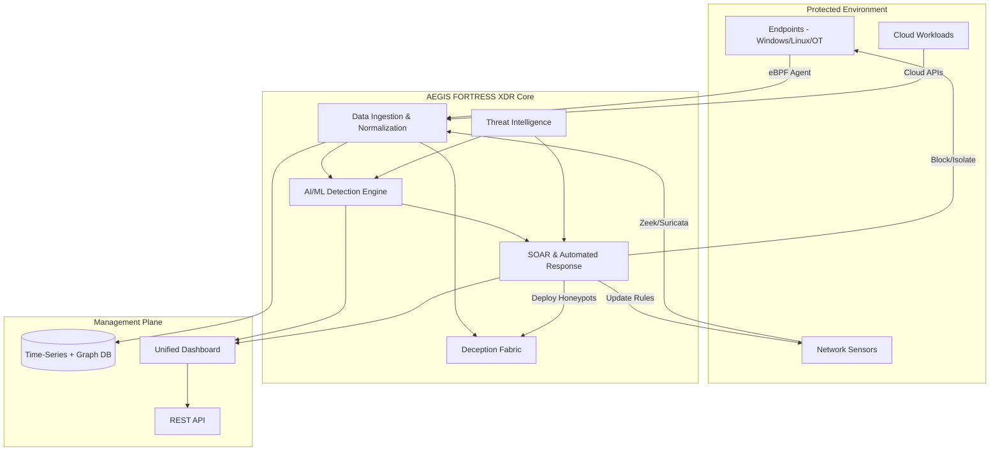

<div align="center">
  <h1>🛡️ AEGIS FORTRESS XDR</h1>
  <p><strong>Open‑Source, Kernel‑Native Extended Detection & Response for Critical Infrastructure</strong></p>
  <p>
    <a href="https://github.com/ss7zx/aegis-fortress-xdr/actions"></a>
    <a href="https://github.com/ss7zx/aegis-fortress-xdr/releases"></a>
    <a href="LICENSE"></a>
    <a href="https://discord.gg/your-invite"></a>
  </p>
  <p>
    <a href="#-features">Features</a> •
    <a href="#-architecture">Architecture</a> •
    <a href="#-quick-start">Quick Start</a> •
    <a href="#-documentation">Documentation</a> •
    <a href="#-community">Community</a> •
    <a href="#-contributing">Contributing</a>
  </p>
  <br>
  
  <br>
  <em>Real‑time threat detection and automated response for power grids, water treatment, and healthcare</em>
</div>

## 🌟 Introduction

**AEGIS FORTRESS XDR** is the world’s first open‑source Extended Detection and Response platform purpose‑built for **critical infrastructure**. Born from the **AEGIS FORTRESS EDR v5.1** kernel‑native sensor, it unifies endpoint, network, cloud, and identity telemetry into a single, AI‑driven defense system. Our mission: democratize advanced cybersecurity so that every utility, hospital, and transportation system—regardless of budget—can defend against nation‑state adversaries and sophisticated cybercriminals.

### Why AEGIS FORTRESS XDR?
- **Kernel‑Native Visibility** – eBPF sensors monitor file, process, network, and registry events with minimal overhead.
- **ICS/OT Focus** – Deep support for Modbus, DNP3, IEC 104, and other industrial protocols.
- **AI‑Powered Detection** – Unsupervised and supervised machine learning models catch zero‑day attacks and reduce false positives.
- **Automated Response** – SOAR playbooks isolate endpoints, block IPs, rotate credentials, and deploy honeypots in seconds.
- **Deception Technology** – Honeypots and honeytokens lure attackers and gather threat intelligence.
- **Open & Auditable** – 100% transparent code; no black boxes.

## ✨ Features

| Area              | Capabilities                                                                                                                                                                                                 |
|-------------------|--------------------------------------------------------------------------------------------------------------------------------------------------------------------------------------------------------------|
| **Endpoint**      | eBPF sensors for Linux & Windows (eBPF for Windows). Real‑time blocking of unauthorized file access, process execution, and network connections.                                                            |
| **Network**       | Zeek metadata, Suricata IDS, custom Rust dissectors for Modbus, DNP3, IEC 104. Flow analytics for beaconing detection.                                                                                      |
| **Cloud**         | Ingests AWS CloudTrail, Azure Monitor, GCP Audit Logs. Detects misconfigurations (public S3, over‑permissive IAM) and anomalous API calls.                                                                  |
| **Detection**     | ML models: autoencoders (anomaly detection), XGBoost (classification), LSTM (time‑series forecasting). Explainable AI with SHAP. Continuous retraining pipeline.                                            |
| **SOAR**          | TheHive for case management, Cortex for enrichment, Shuffle for playbooks. Automated actions: process kill, network isolation, credential rotation, firewall updates, honeypot deployment.                  |
| **Deception**     | Conpot (ICS honeypots), Cowrie (SSH), custom decoys. Adaptive deployment upon scan detection. Honeytokens (fake files, DB records, API keys) trigger alerts when accessed.                                  |
| **Threat Intel**  | MISP integration – consume and share IOCs via STIX/TAXII. Enrich alerts with external feeds (VirusTotal, Shodan, OTX).                                                                                      |
| **Dashboard**     | Real‑time React UI with live alerts, process trees, network graphs, incident timelines. Reporting (PDF/CSV) for compliance. RBAC with LDAP/OAuth.                                                           |
| **Self‑Healing**  | Golden images (Packer) + Infrastructure as Code (Terraform) to automatically rebuild compromised assets. Kubernetes integration for container recovery.                                                      |

## 🏗️ Architecture

The platform is designed as a set of loosely coupled microservices, enabling scalability and resilience.

### High‑Level Block Diagram

```
┌─────────────────────────────────────────────────────────────────┐
│                      AEGIS FORTRESS XDR                         │
├───────────────┬────────────────┬───────────────┬───────────────┤
│  Endpoint     │  Network       │  Cloud        │  Identity     │
│  Agents       │  Sensors       │  Logs         │  Logs         │
├───────────────┴────────────────┴───────────────┴───────────────┤
│                    Data Ingestion & Normalization                │
│                           (Kafka + ECS)                          │
├───────────────┬────────────────┬───────────────┬───────────────┤
│  AI/ML        │  Deception     │  SOAR         │  Threat Intel │
│  Detection    │  Fabric        │  (TheHive,    │  (MISP)       │
│  Engine       │                │   Shuffle)    │               │
├───────────────┴────────────────┴───────────────┴───────────────┤
│                   Unified Dashboard & API                        │
│                       (React + Go)                               │
└─────────────────────────────────────────────────────────────────┘
```

### Detailed Component Graph (Mermaid)



For detailed component diagrams and data flows, see our [Architecture Documentation](docs/ARCHITECTURE.md).

## 🚀 Quick Start

### Prerequisites
- Docker & Docker Compose (v2.0+)
- Linux kernel ≥ 5.4 (for eBPF features)
- 8 GB RAM, 4 CPUs recommended

### One‑Command Lab Deployment
```bash
git clone https://github.com/ss7zx/aegis-fortress-xdr.git
cd aegis-fortress-xdr
docker-compose up -d
```

This spins up:
- Kafka + Zookeeper
- Zeek + Suricata sensors
- TheHive, Cortex, Shuffle
- A sample React dashboard
- One simulated endpoint with the eBPF agent (in a container)

Access the dashboard at `http://localhost:3000`  
Default credentials: `admin` / `aegis123`

> ⚠️ This is a **development environment**. For production deployment, see our [Installation Guide](docs/INSTALL.md).

## 📚 Documentation

Full documentation is available in the [`docs/`](docs/) folder:

- [Installation Guide](docs/INSTALL.md) – bare‑metal, Kubernetes, cloud (AWS/Azure/GCP)
- [User Manual](docs/USER_MANUAL.md) – using the dashboard, creating playbooks, investigating incidents
- [Agent Deployment](docs/AGENT.md) – deploying eBPF agents on Linux/Windows endpoints
- [API Reference](docs/API.md) – REST & GraphQL endpoints (Swagger UI)
- [Contributing Guide](docs/CONTRIBUTING.md) – how to get involved
- [Security Policies](docs/SECURITY.md) – reporting vulnerabilities

We also maintain a [Wiki](https://github.com/ss7zx/aegis-fortress-xdr/wiki) with tutorials, best practices, and FAQs.

## 🧑‍🤝‍🧑 Community

Join our growing community of defenders, developers, and researchers:

- 💬 [Discord](https://discord.gg/your-invite) – real‑time chat and support
- 🐦 [Twitter](https://twitter.com/aegisfortress) – project updates and news
- 📧 [Mailing List](https://groups.google.com/g/aegis-fortress) – low‑traffic announcements
- 🗓️ [Community Calls](https://calendar.google.com/...) – monthly video meetings (open to all)

We welcome contributors of all skill levels. Check out our [good first issues](https://github.com/ss7zx/aegis-fortress-xdr/labels/good%20first%20issue) to get started.

## 🤝 Contributing

We believe that open source security is stronger together. Whether you’re fixing a bug, writing documentation, or proposing a new feature, your help is appreciated.

1. Read the [Contributing Guide](docs/CONTRIBUTING.md).
2. Fork the repository and create a feature branch.
3. Make your changes, ensuring tests pass (`make test`).
4. Open a pull request with a clear description.

By participating, you agree to abide by our [Code of Conduct](CODE_OF_CONDUCT.md).

## 📄 License

AEGIS FORTRESS XDR is dual‑licensed:

- **Core components** (agent, sensors, detection engine) are under **Apache License 2.0**.
- **Enterprise plugins** (optional) are under a commercial license.

See [LICENSE](LICENSE) for details.

## 🌍 Impact & Vision

Our mission is to protect the world’s most critical infrastructure. By open‑sourcing AEGIS FORTRESS XDR, we enable:

- **Utilities** to defend against nation‑state attacks.
- **Hospitals** to ensure patient safety.
- **Manufacturing** to prevent costly downtime.
- **Governments** to build sovereign security capabilities.

We collaborate with **CERTs, ISACs, and academic institutions** to share threat intelligence and advance the state of the art. Together, we can build a safer digital world.

## 🙏 Acknowledgements

This project builds upon the incredible work of the open‑source community:

- [eBPF](https://ebpf.io/) – kernel instrumentation
- [Zeek](https://zeek.org/) – network analysis
- [Suricata](https://suricata.io/) – intrusion detection
- [TheHive](https://thehive-project.org/) – incident response
- [Cortex](https://cortex.thehive-project.org/) – observable analysis
- [Shuffle](https://shuffler.io/) – SOAR workflows
- [MISP](https://www.misp-project.org/) – threat intelligence
- [Elastic Common Schema](https://www.elastic.co/guide/en/ecs/current/index.html) – data normalization
- And countless others…

---

<div align="center">
  <strong>Defend the future. Join AEGIS FORTRESS XDR.</strong><br>
  <a href="https://github.com/ss7zx/aegis-fortress-xdr">GitHub</a> •
  <a href="https://discord.gg/your-invite">Discord</a> •
  <a href="https://twitter.com/aegisfortress">Twitter</a>
</div>
